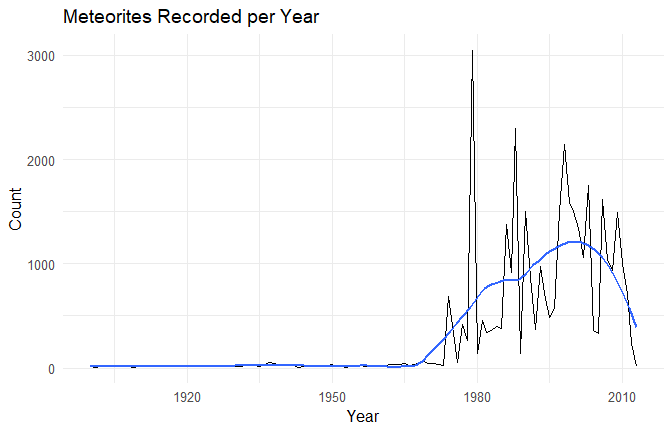

Meteorite Landings Since 1900
================
Harika Nalika & Ethan Olderog

# Introduction

Space rocks are interesting because they come from outside Earth.  
This project looks at meteorite records since 1900. I will answer three
simple questions:

- Are we finding more pieces now than before?
- What kinds show up the most?
- Where do the biggest ones show up?

If something did not look right, I checked it before moving on.

# Data

I used NASA’s public “Meteorite Landings” CSV.  
Important columns:

- `name` - an id for the piece
- `year` - the year it was found or seen falling
- `mass` - the mass in grams
- `recclass` - the type
- `reclat`, `reclong` - the location (or I can parse it from a text
  field named `GeoLocation` if needed)

Cleaning steps I used:

1.  Drop rows with missing year, latitude, longitude, or mass, or with
    mass less than or equal to 0.
2.  Turn date-time into just a year when needed.
3.  Keep only years from 1900 up to the current year, so there are no
    future years in the plots.

``` r
# Libraries
for (pkg in c("readr","dplyr","tidyr","lubridate")) {
  if (!requireNamespace(pkg, quietly = TRUE)) {
    stop(paste('Package "', pkg, '" is required. install.packages("', pkg, '")', sep = ""))
  }
}
library(readr); library(dplyr); library(tidyr); library(lubridate)

# Require the CSV to be in the same folder; fail fast with a clear message
if (!file.exists("meteorite-landings.csv")) {
  stop('Could not find "meteorite-landings.csv" in the working directory. Place the CSV next to this Rmd and knit again.')
}

raw_mets <- readr::read_csv("meteorite-landings.csv", guess_max = 100000, show_col_types = FALSE)

# Some copies use "mass (g)" instead of "mass"
if (!("mass" %in% names(raw_mets)) && ("mass (g)" %in% names(raw_mets))) {
  raw_mets <- dplyr::rename(raw_mets, mass = `mass (g)`)
}

# If reclat and reclong are missing but GeoLocation exists like "(lat, long)",
# extract them using simple string steps (no backslash escapes)
if (!("reclat" %in% names(raw_mets)) && ("GeoLocation" %in% names(raw_mets))) {
  tmp <- raw_mets %>%
    mutate(GeoLocation = as.character(GeoLocation)) %>%
    mutate(GeoLocation_clean = gsub("[()]", "", GeoLocation)) %>%
    tidyr::separate(GeoLocation_clean, into = c("lat_extracted", "long_extracted"),
                    sep = ",", fill = "right", extra = "drop", remove = FALSE) %>%
    mutate(lat_extracted = trimws(lat_extracted),
           long_extracted = trimws(long_extracted))
  if ("lat_extracted" %in% names(tmp) && "long_extracted" %in% names(tmp)) {
    raw_mets <- tmp %>%
      mutate(reclat = lat_extracted, reclong = long_extracted) %>%
      select(-lat_extracted, -long_extracted, -GeoLocation_clean)
  }
}

# Helper: safe numeric conversion
to_numeric <- function(x) {
  if (is.numeric(x)) return(x)
  suppressWarnings(as.numeric(as.character(x)))
}

current_year <- lubridate::year(Sys.Date())

# Parse and clean
mets <- raw_mets %>%
  mutate(
    year_raw = year,
    # Try several date formats; fall back to integer if already just a year
    year = suppressWarnings(lubridate::year(lubridate::ymd_hms(as.character(year)))),
    year = ifelse(is.na(year), suppressWarnings(lubridate::year(lubridate::ymd(as.character(year)))), year),
    year = ifelse(is.na(year), suppressWarnings(as.integer(as.character(year_raw))), year),
    lat  = to_numeric(reclat),
    long = to_numeric(reclong),
    mass = to_numeric(mass)
  ) %>%
  filter(!is.na(year), year >= 1900, year <= current_year,
         !is.na(lat), !is.na(long),
         !is.na(mass), mass > 0) %>%
  mutate(decade = floor(year / 10) * 10)

# Quick check
dplyr::glimpse(mets)
```

    ## Rows: 37,389
    ## Columns: 14
    ## $ name        <chr> "Aarhus", "Abee", "Acapulco", "Achiras", "Adhi Kot", "Adzh…
    ## $ id          <dbl> 2, 6, 10, 370, 379, 390, 398, 417, 423, 424, 426, 432, 433…
    ## $ nametype    <chr> "Valid", "Valid", "Valid", "Valid", "Valid", "Valid", "Val…
    ## $ recclass    <chr> "H6", "EH4", "Acapulcoite", "L6", "EH4", "LL3-6", "L6", "L…
    ## $ mass        <dbl> 720, 107000, 1914, 780, 4239, 910, 1620, 1440, 1000, 24000…
    ## $ fall        <chr> "Fell", "Fell", "Fell", "Fell", "Fell", "Fell", "Fell", "F…
    ## $ year        <int> 1951, 1952, 1976, 1902, 1919, 1949, 1930, 1920, 1974, 1925…
    ## $ reclat      <dbl> 56.18333, 54.21667, 16.88333, -33.16667, 32.10000, 44.8333…
    ## $ reclong     <dbl> 10.23333, -113.00000, -99.90000, -64.95000, 71.80000, 95.1…
    ## $ GeoLocation <chr> "(56.183330, 10.233330)", "(54.216670, -113.000000)", "(16…
    ## $ year_raw    <dbl> 1951, 1952, 1976, 1902, 1919, 1949, 1930, 1920, 1974, 1925…
    ## $ lat         <dbl> 56.18333, 54.21667, 16.88333, -33.16667, 32.10000, 44.8333…
    ## $ long        <dbl> 10.23333, -113.00000, -99.90000, -64.95000, 71.80000, 95.1…
    ## $ decade      <dbl> 1950, 1950, 1970, 1900, 1910, 1940, 1930, 1920, 1970, 1920…

# Results and simple explanations

I tried a few plots and kept the ones that answered the questions
directly.

``` r
summary_tbl <- mets %>%
  summarise(
    n_meteorites  = n(),
    mean_mass_g   = mean(mass, na.rm = TRUE),
    median_mass_g = median(mass, na.rm = TRUE),
    heaviest_g    = max(mass, na.rm = TRUE)
  )

knitr::kable(summary_tbl, caption = "Overall summary statistics")
```

| n_meteorites | mean_mass_g | median_mass_g | heaviest_g |
|-------------:|------------:|--------------:|-----------:|
|        37389 |    7218.089 |          27.7 |      6e+07 |

Overall summary statistics

**Plain explanation:**  
This table tells us how many rows we have and the basic mass numbers. If
the mean is much bigger than the median, it means there are a few very
heavy meteorites that pull up the average. That is normal with this kind
of data.

``` r
mets %>%
  count(year, name = "n") %>%
  ggplot(aes(x = year, y = n)) +
  geom_line(na.rm = TRUE) +
  labs(title = "Meteorites Found per Year",
       x = "Year", y = "Count")
```

<figure>

<figcaption aria-hidden="true">Meteorites found per year (no future
years).</figcaption>
</figure>

**Plain explanation:**  
Each point shows how many meteorites were recorded in that year. The
line goes up and down, but overall it rises. This means we record more
finds now than in the early 1900s. Better tools and more searching
likely help.

``` r
mets %>%
  group_by(decade) %>%
  summarise(median_mass = median(mass, na.rm = TRUE), .groups = "drop") %>%
  ggplot(aes(x = decade, y = median_mass)) +
  geom_line(na.rm = TRUE) +
  labs(title = "Median Mass by Decade",
       x = "Decade", y = "Median Mass (g)")
```

<figure>

<figcaption aria-hidden="true">Typical meteorite mass by decade
(median).</figcaption>
</figure>

**Plain explanation:**  
This shows the typical mass in each decade. If the line is lower in
recent decades, that means we are logging more small pieces now. That
makes sense because small fragments are easier to find with modern
methods.

``` r
# Top 5 classes across decades
class_counts <- mets %>%
  filter(!is.na(recclass), recclass != "") %>%
  count(recclass, sort = TRUE)

top_classes <- class_counts %>%
  slice_head(n = 5) %>%
  pull(recclass)

class_by_decade <- mets %>%
  filter(recclass %in% top_classes) %>%
  group_by(recclass, decade) %>%
  summarise(n = n(), .groups = "drop")

stopifnot(nrow(class_by_decade) > 0)

ggplot(class_by_decade, aes(decade, n, group = recclass)) +
  geom_line(aes(linetype = recclass)) +
  labs(title = "Top 5 Meteorite Classes Across Decades",
       x = "Decade", y = "Count", linetype = "Class")
```

<figure>

<figcaption aria-hidden="true">Top 5 meteorite classes across
decades.</figcaption>
</figure>

**Plain explanation:**  
This compares the most common types over time. If a type stays high
across many decades, it is consistently common. In public data, ordinary
chondrites are usually the most common. You can see that pattern here
too.

``` r
# Map heaviest 1 percent with a fallback if the maps package is not installed
mass_cutoff <- stats::quantile(mets$mass, 0.99, na.rm = TRUE)

top1 <- mets %>%
  filter(!is.na(lat), !is.na(long), mass >= mass_cutoff)

if (nrow(top1) == 0) {
  warning("Heaviest 1 percent subset is empty. Check mass parsing.")
}

if (requireNamespace("maps", quietly = TRUE)) {
  world <- ggplot2::map_data("world")

  ggplot() +
    geom_polygon(data = world,
                 mapping = aes(long, lat, group = group),
                 fill = "gray90", color = "white", linewidth = 0.2) +
    geom_point(data = top1, aes(long, lat),
               size = 1.5, alpha = 0.6) +
    coord_fixed(1.3) +
    labs(title = "Heaviest 1 Percent - Locations",
         subtitle = "Basemap requires the maps package",
         x = "Longitude", y = "Latitude")
} else {
  # Fallback: plot points without a basemap so it never knits blank
  ggplot(top1, aes(long, lat)) +
    geom_point(size = 1.5, alpha = 0.6) +
    coord_fixed(1.3) +
    labs(title = "Heaviest 1 Percent - Locations",
         subtitle = "Basemap not installed. Showing points only.",
         x = "Longitude", y = "Latitude")
}
```

<figure>

<figcaption aria-hidden="true">Where the heaviest 1 percent of
meteorites were recorded.</figcaption>
</figure>

**Plain explanation:**  
These dots show where the biggest meteorites in the dataset were found.
You will notice a lot in desert and open areas. That fits basic common
sense. Big dark rocks are easier to see and keep their shape better on
bare ground.

# Conclusion

Main takeaways in simple words:

- We record more meteorites per year now than we did long ago.
- The typical mass is smaller in recent decades, which fits with finding
  more small pieces.
- A few types are common almost every decade. Ordinary chondrites are
  the most common.
- The biggest pieces show up in many places, but deserts and open land
  make them easier to spot.

# Reproducibility

All results come directly from the code chunks. Knit this file and you
should see the same numbers and figures.  
Keep “meteorite-landings.csv” in the same folder as this Rmd.

``` r
sessionInfo()
```

    ## R version 4.5.0 (2025-04-11 ucrt)
    ## Platform: x86_64-w64-mingw32/x64
    ## Running under: Windows 10 x64 (build 19045)
    ## 
    ## Matrix products: default
    ##   LAPACK version 3.12.1
    ## 
    ## locale:
    ## [1] LC_COLLATE=English_United States.utf8 
    ## [2] LC_CTYPE=English_United States.utf8   
    ## [3] LC_MONETARY=English_United States.utf8
    ## [4] LC_NUMERIC=C                          
    ## [5] LC_TIME=English_United States.utf8    
    ## 
    ## time zone: America/Chicago
    ## tzcode source: internal
    ## 
    ## attached base packages:
    ## [1] stats     graphics  grDevices utils     datasets  methods   base     
    ## 
    ## other attached packages:
    ## [1] lubridate_1.9.4 tidyr_1.3.1     dplyr_1.1.4     readr_2.1.5    
    ## [5] ggplot2_3.5.2  
    ## 
    ## loaded via a namespace (and not attached):
    ##  [1] bit_4.6.0          gtable_0.3.6       jsonlite_2.0.0     crayon_1.5.3      
    ##  [5] compiler_4.5.0     maps_3.4.3         tidyselect_1.2.1   parallel_4.5.0    
    ##  [9] jquerylib_0.1.4    scales_1.4.0       yaml_2.3.10        fastmap_1.2.0     
    ## [13] R6_2.6.1           labeling_0.4.3     generics_0.1.4     knitr_1.50        
    ## [17] tibble_3.2.1       bslib_0.9.0        pillar_1.10.2      RColorBrewer_1.1-3
    ## [21] tzdb_0.5.0         rlang_1.1.6        cachem_1.1.0       xfun_0.52         
    ## [25] sass_0.4.10        bit64_4.6.0-1      timechange_0.3.0   cli_3.6.5         
    ## [29] withr_3.0.2        magrittr_2.0.3     digest_0.6.37      grid_4.5.0        
    ## [33] vroom_1.6.5        hms_1.1.3          lifecycle_1.0.4    vctrs_0.6.5       
    ## [37] evaluate_1.0.3     glue_1.8.0         farver_2.1.2       rmarkdown_2.29    
    ## [41] purrr_1.0.4        tools_4.5.0        pkgconfig_2.0.3    htmltools_0.5.8.1
